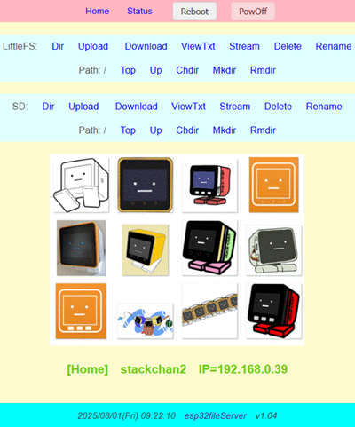
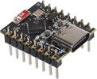
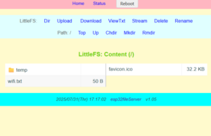
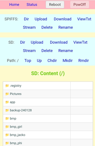

# esp32fileServer
**[`　日本語 (Japanese)　`](README_jp.md)**




## Manual

### 1. Overview

This is software that transforms general-purpose ESP32-based development boards and M5Stack devices into a **Web File Server** operating on a WiFi network. It enables you to manage files (list, upload, download, delete, and view images, audio, text files, etc.) on `LittleFS`, `SPIFFS`, or an `SD` card through a web browser.

**Main Purpose:**

*   To provide a way to access and manage files on ESP32 development boards and M5Stack devices from a PC or smartphone.
*   To make it easy to view text files and images, check audio, and update programs.
*   To offer the software's functionality in a way that is easy to integrate into other projects.<br>
(Feel free to use it as you wish.)<br>
    <br>

### 2. Main Features

- **Web Server**: Provides a file management interface via HTTP.
- **WiFi Connection**: Automatically connects to WiFi with the specified SSID and password.<br>
    
    In addition to hardcoding credentials, the following WiFi connection methods are supported:
    - Using a `wifi.txt` file (in the root of LittleFS/SPIFFS/SD)
    - Connecting with the last successful connection settings
    - SmartConfig

- **Multi-File System Support**:
  - LittleFS (Default)
  - SPIFFS
  - SD Card

  Directory operations are available for SD and LittleFS.
  
- **mDNS Support**: Allows access using a hostname like `esp32fileServer`.

### 3. Supported Devices
- **General-purpose ESP32 Development Boards:**
  Operation has been confirmed on the `ESP32 C3 SuperMini`Development Board (esp32-c3-devkitm-1).<br>
  <br>
  By default, it is configured to use LittleFS.  If you are using other development boards, please add the necessary configuration to `platformio.ini`.<br>

- **M5Stack Devices**: M5StackCore2, CoreS3, Cardputer<br>
For M5Stack devices, it utilizes the SD card, LCD screen, and RTC.<br>
By default, it is configured to use both LittleFS and the SD card.<br>

### 4. Network Configuration

**Method 1 (Recommended):** Create a file named `wifi.txt` in the root directory of the SD card/LittleFS or SPIFFS with the following format:

```
   your_wifi_ssid
   your_wifi_ssid_password
   your_server_name
```
(Please add a newline at the end of each line. `your_server_name` is the name used for mDNS.)


**Method 2:** You can use the `SmartConfig` feature. Please install a SmartConfig-compatible app (like `EspTouch`) on your smartphone. Once configured, the device will attempt to connect using the previous settings on subsequent boots.


**Method 3:** Directly edit the values of `YOUR_SSID`, `YOUR_SSID_PASS`, and `YOUR_SERVER_NAME` in `main.cpp`.<br>

Open the `src/main.cpp` file and set the SSID and password for your WiFi access point.

```cpp
// ***  SETTINGS  ***
const String YOUR_SSID = "Your_SSID";
const String YOUR_SSID_PASS = "Your_Password";
const String YOUR_HOST_NAME = "esp32fileServer";
```

`YOUR_HOST_NAME` is the name to identify the device on the network (mDNS hostname). Change it as needed.


### 5. Access
   When the device starts up, it connects to WiFi, and the IP address and server name are displayed on the Serial Monitor (and on the screen if a display is enabled).
    *   Access the displayed IP address (`http://<IP_address>/`) or mDNS name (`http://<server_name>/` or `http://<server_name>.local/`) from a web browser on a PC or smartphone on the same network.

 **Check the Serial Monitor**: After flashing, open the Serial Monitor (Baud rate: 115200) to see the WiFi connection status and IP address.

    ```
    - esp32fileServer -
    WiFi    .....  OK

    IP: 192.168.x.x
    SV: esp32fileServer
    *** setup() done! ***
    ```


---

### 6. Display and Operation
  Click the menus and buttons on the web interface to perform file operations and check system information.


**PC and Smartphone Screen Display:**

It uses a responsive design that adjusts to optimally fit the screen width.

 [PC](images/gazo10.png)

[Smartphone](images/gazo02.jpg)


---


## Software Documentation


### 1. Functional Overview

*   **File System Access:**
    *   LittleFS (File system on internal flash memory, when `LittleFS_USE = true`): Default
    *   SPIFFS (File system on internal flash memory, when `SPIFFS_USE = true`)
    *   SD Card (For M5Stack Core2/CoreS3/Cardputer, when `SD_USE = true`)
*   **Web Interface (Responsive Design):**

    *   **File/Directory Listing:**
        *   SD Card: Displays the contents of the current directory (files and subdirectories).
        *   SPIFFS: Displays a list of files in the root directory.
        *   Displays file name and size.
    *   **File Operations:**
        *   Upload: Transfer files from a PC/smartphone to the device.
        *   Download: Save files from the device to a PC/smartphone.
        *   Streaming: Directly view images, audio, text, etc., in the browser.
        *   Delete: Select and delete files (with a confirmation prompt).
        *   Rename: Select and change a file name.
        *   Text View: Display text files like `.txt`, `.log`, `.html` in the browser.
    *   **LittleFS/SD Card Directory Operations:**
        *   Change Directory (Move to a subdirectory).
        *   Create Directory.
        *   Delete Directory (Only if empty, with a confirmation prompt).
        *   Move to Parent/Root Directory.
*   **Network Features:**
    *   **WiFi Connection:** Connects to a WiFi access point in STA mode with a specified SSID and password.
    *   **mDNS:** Accessible via `http://(configured_server_name)/` or `http://(configured_server_name).local/`.
    *   **Configuration File:** The network settings in `main.cpp` can be overridden by a `wifi.txt` file on the SD card/LittleFS/SPIFFS.
*   **System Information Display (`/system`):**
    *   File system usage (SD/SPIFFS).
    *   Memory usage (SRAM/PSRAM).
    *   NVS Information.
    *   CPU Information.
    *   Network information (IP address, MAC address, etc.).
    *   Time information (RTC/NTP).
    *   File transfer statistics.
*   **Web API:**
    *   `/shutdown?reboot=on`: Reboot the device.
    *   `/shutdown`: Shutdown the device (power off).
*   **Other:**
    *   **NTP Time Synchronization:** Retrieves time from an NTP server at startup and adjusts the RTC (if `RTC_ADJUST_REQ = true`).
    *   **SD Card Updater:** (Optional) Firmware update feature from the SD card.
    *   **Display Output:** (Optional) Displays the IP address, etc., on the M5Stack screen.
    *   **Favicon/Home Image:** Displays `favicon.ico` / `homeImg.gif` if they exist in the root directory.

### 2. File Structure (Key Files)

*   **`main.cpp`**: Application entry point. Global settings, initialization calls, main loop.
*   **`fileServer/fileServer.cpp`**: Basic web server settings, common HTML generation, handlers for the homepage (`/`) and system information page (`/system`).
*   **`fileServer/fs_util.cpp`**: Helper functions for WiFi connection, mDNS, NTP time sync, configuration file reading, etc.
*   **`fileServer/SD_handler.cpp`**: Web interface and file/directory operation handling for the SD card.
*   **`fileServer/LF_handler.cpp`**: Web interface and file/directory operation handling for LittleFS.
*   **`fileServer/SPIFFS_handler.cpp`**: Web interface and file operation handling for SPIFFS.
*   **`fileServer/m5Stack_device.cpp`**: M5Stack device-specific controls.

*   **`fileServer/webApi.cpp`**: Handles Web API endpoints like `/shutdown`.
*   **`fileServer/fileServer.h`**: Shared definitions, declarations, and includes for the entire project.

### 3. Selecting the File System

Specify the file system to use with compile-time flags. If you are using PlatformIO, it is common to set this in the `build_flags` of `platformio.ini`.

- **LittleFS (Default)**: `-D FILES_LITTLEFS`
- **SPIFFS**: `-D FILES_SPIFFS`
- **SD Card**: `-D FILES_SD`

The preprocessor directives in `main.cpp` automatically select the file system to use based on these flags.

```cpp
#ifdef FILES_LITTLEFS
const bool LittleFS_USE = true; // (default) LittleFS instead of SPIFFS
const bool SPIFFS_USE = false;
#else
const bool LittleFS_USE = false;
const bool SPIFFS_USE = true;
#endif

#ifdef FILES_SD
const bool SD_USE = true;
#else
const bool SD_USE = false;
#endif
```


### 4. LICENSE
MIT LICENSE

**Version:** v1.05  
**Author:** NoRi  
**GitHub:** https://github.com/NoRi-230401/esp32fileServer


    
<br>

*   The included `homeImg.gif` and `favicon.ico` use illustrations from "Stack-chan Public Materials".
    -  Okimoku-san's "Stack-chan Public Materials" wiki<br>
    Thanks to the original author for creating and licensing the images, and to 'Okimoku-san' for compiling the public materials