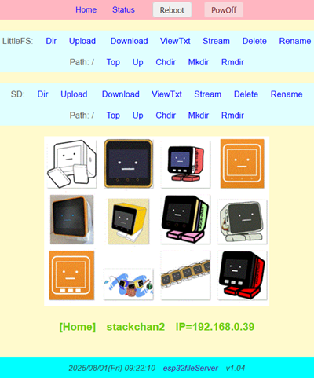
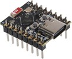
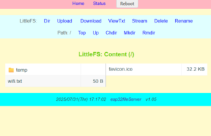
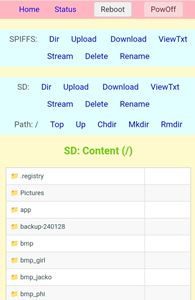

# esp32fileServer
**[`　English　`](README.md)**




## 説明書

### 1.概要

`ESP32ベースの汎用開発ボード`や`M5Stackデバイス` をWiFiネットワーク上で動作する**Webファイルサーバー**にするソフトウエアです。Webブラウザを通じて、`LittleFS`または、`SPIFFS`や`SD`のファイルを操作（ファイル一覧表示、アップロード、ダウンロード、削除、画像・音声・テキストファイル等の表示）できるようになります。

**主な目的:**

*   PCやスマートフォンからESP32開発ボードおよびM5Stackデバイス上のファイルへアクセス・管理する手段を提供する。
*   テキスト・ファイルや画像の表示、音声の確認やプログラムの更新などを容易にする。
*   他のソフトウエアに、このソフトの機能を組み込みやすいように提供する。<br>
(ご自由にご活用ください。)<br>
    <br>

### 2. 主な機能

- **Webサーバー**: HTTP経由でのファイル操作インターフェースを提供します。
- **WiFi接続**: 指定されたSSIDとパスワードでWiFiに自動接続します。<br>
    
    WiFiの接続は、プログラム内にコード直接入れる他にも次の方法を提供しています。
    - `wifi.txt` ファイル使用（LittleFS/SPIFFS/SDのルートのファイル）
    - 前回接続成功した設定で接続
    -  SmartConfig


- **マルチファイルシステム対応**:
  - LittleFS (デフォルト)
  - SPIFFS
  - SDカード

　SDとLittleFSは、ディレクトリの操作ができます。
  
- **mDNS対応**: `esp32fileServer` のようなホスト名でアクセスできます。

### 3.  対応デバイス
- **汎用ESP32開発ボード：**
    `ESP32 C3 SuperMini` Development Board（esp32-c3-devkitm-1）で動作の確認しています。<br>
    <br>
    デフォルトでは、LittleFSが使用できるようにしています。<br>
    他の開発ボードを使用する場合にはplatformIo.iniの設定を追加してください。<br>

- **M5Stackデバイス**: M5StackCore2,CoreS3,Cardputer<br>
    M5Stackデバイス向けにSDとLCD画面およびRTCを使用しています。<br>
    デフォルトでは、LittleFSとSDが使用できるようにしています。<br>

### 4.ネットワーク設定

**方法1 (推奨):** SDカード/LittleFSまたはSPIFFSのルートディレクトリに `wifi.txt` という名前のファイルを作成し、以下の形式で記述します。

```
   your_wifi_ssid
   your_wifi_ssid_password
   your_server_name
```
(各行の末尾に改行を入れてください。`your_server_name` はmDNSで使用する名前です。)


**方法2:** 　`SmartConfig` の機能を使用できます。スマートホンにSmartConfig対応のアプリ（`EspTouch`等）をインストールしてください。一度設定をおこなえば前回の設定で接続できるようにしています。


**方法3:** `main.cpp` 内の `YOUR_SSID`, `YOUR_SSID_PASS`, `YOUR_SERVER_NAME` の値を直接編集します。<br>

`src/main.cpp` ファイルを開き、お使いのWiFiアクセスポイントのSSIDとパスワードを設定します。

```cpp
// ***  SETTINGS  ***
const String YOUR_SSID = "あなたのSSID";
const String YOUR_SSID_PASS = "あなたのパスワード";
const String YOUR_HOST_NAME = "esp32fileServer";
```

`YOUR_HOST_NAME` は、ネットワーク内でデバイスを識別するための名前（mDNSホスト名）です。必要に応じて変更してください。


### 5.アクセス
   デバイスを起動すると、WiFiに接続し、IPアドレスとサーバー名がシリアルモニター (およびディスプレイが有効なら画面) に表示されます。
    *   同じネットワーク内のPCやスマートフォンのWebブラウザで、表示されたIPアドレス (`http://<IPアドレス>/`) またはmDNS名 (`http://<サーバー名>/`または`http://<サーバー名>.local/`) にアクセスします。

 **シリアルモニターの確認**: 書き込み後、シリアルモニター（ボーレート: 115200）を開くと、WiFiへの接続状況とIPアドレスが表示されます。

    ```
    - esp32fileServer -
    WiFi    .....  OK

    IP: 192.168.x.x
    SV: esp32fileServer
    *** setup() done! ***
    ```


---

### 6. 表示と操作
  表示されたWebインターフェース上のメニューやボタンをクリックして、ファイル操作やシステム情報の確認を行います。


**PCおよびスマホの画面表示:**

レスポンシブデザインで画面の広さに応じて最適になるように調整しています。

 [PC](images/gazo10.png)

[スマホ](images/gazo02.jpg)


---


## ソフトウエア解説書


### 1.機能概要

*   **ファイルシステムアクセス:**
    *   LittleFS (内蔵フラッシュメモリ上のファイルシステム, `LittleFS_USE = true` の場合):デフォルト
    *   SPIFFS (内蔵フラッシュメモリ上のファイルシステム, `SPIFFS_USE = true` の場合)
    *   SDカード（M5Stack Core2/CoreS3/Cardputer用）`SD_USE = true` の場合)
*   **Webインターフェース (レスポンシブデザイン):**

    *   **ファイル/ディレクトリ一覧表示:**
        *   SDカード: カレントディレクトリの内容 (ファイルとサブディレクトリ) を表示。
        *   SPIFFS: ルートにあるファイル一覧を表示。
        *   ファイル名、サイズを表示。
    *   **ファイル操作:**
        *   アップロード: PC/スマホからM5Stackへファイルを転送。
        *   ダウンロード: M5Stack上のファイルをPC/スマホへ保存。
        *   ストリーミング: 画像、音声、テキストなどをブラウザで直接表示。
        *   削除: ファイルを選択して削除 (確認画面あり)。
        *   リネーム: ファイル名を選択して変更。
        *   テキスト表示: `.txt`, `.log`, `.html` などのテキストファイルをブラウザ上で表示。
    *   **Lit5tleFS/SDカード ディレクトリ操作:**
        *   ディレクトリ変更 (サブディレクトリへ移動)。
        *   ディレクトリ作成。
        *   ディレクトリ削除 (空の場合のみ、確認画面あり)。
        *   親ディレクトリ/ルートディレクトリへ移動。
*   **ネットワーク機能:**
    *   **WiFi接続:** 指定されたSSIDとパスワードでWiFiアクセスポイントに接続 (STAモード)。
    *   **mDNS:** `http://(設定したサーバー名)/`または、`http://(設定したサーバー名).local/` でアクセス可能。
    *   **設定ファイル:** SDカード/LittlFS/SPIFFSの `wifi.txt` で`main.cpp`のネットワーク設定を上書き可能。
*   **システム情報表示 (`/system`):**
    *   ファイルシステムの使用状況 (SD/SPIFFS)。
    *   メモリ使用状況 (SRAM/PSRAM)。
    *   NVS情報。
    *   CPU情報。
    *   ネットワーク情報 (IPアドレス、MACアドレスなど)。
    *   時刻情報 (RTC/NTP)。
    *   ファイル転送統計。
*   **Web API:**
    *   `/shutdown?reboot=on`: デバイスを再起動。
    *   `/shutdown`: デバイスをシャットダウン (電源オフ)。
*   **その他:**
    *   **NTP時刻同期:** 起動時にNTPサーバーから時刻を取得し、RTCを調整 (`RTC_ADJUST_REQ = true` の場合)。
    *   **SDカードアップデーター:** (オプション) SDカードからのファームウェア更新機能。
    *   **ディスプレイ表示:** (オプション) IPアドレスなどをM5Stack画面に表示。
    *   **Favicon/ホーム画像:** ルートに `favicon.ico` / `homeImg.gif` があれば表示。

### 2. ファイル構成 (主要ファイル)

*   **`main.cpp`**: アプリケーションのエントリーポイント。全体設定、初期化呼び出し、メインループ。
*   **`fileServer/fileServer.cpp`**: Webサーバーの基本設定、共通HTML生成、ホームページ(`/`)・システム情報ページ(`/system`)のハンドラ。
*   **`fileServer/fs_util.cpp`**: WiFi接続、mDNS、NTP時刻同期、設定ファイル読み込みなどの補助関数。
*   **`fileServer/SD_handler.cpp`**: SDカード関連のWebインターフェースとファイル/ディレクトリ操作処理。
*   **`fileServer/LF_handler.cpp`**: LittleFS関連のWebインターフェースとファイル/ディレクトリ操作処理。
*   **`fileServer/SPIFFS_handler.cpp`**: SPIFFS関連のWebインターフェースとファイル操作処理。
*   **`fileServer/m5Stack_device.cpp`**: M5Stackデバイス固有の制御。

*   **`fileServer/webApi.cpp`**: `/shutdown` などのWeb APIエンドポイントの処理。
*   **`fileServer/fileServer.h`**: プロジェクト全体で共有される定義、宣言、インクルード。

### 3. ファイルシステムの選択

使用するファイルシステムをコンパイル時のフラグで指定します。PlatformIOをお使いの場合、`platformio.ini` の `build_flags` で設定するのが一般的です。

- **LittleFS (デフォルト)**: `-D FILES_LITTLEFS`
- **SPIFFS**: `-D FILES_SPIFFS`
- **SDカード**: `-D FILES_SD`

`main.cpp` 内のプリプロセッサ命令により、これらのフラグに基づいて使用するファイルシステムが自動的に選択されます。

```cpp
#ifdef FILES_LITTLEFS
const bool LittleFS_USE = true; // (default) LittleFS instead of SPIFFS
const bool SPIFFS_USE = false;
#else
const bool LittleFS_USE = false;
const bool SPIFFS_USE = true;
#endif

#ifdef FILES_SD
const bool SD_USE = true;
#else
const bool SD_USE = false;
#endif
```


### 4.LICENSE
[MIT LICENSE](LICENSE)

**バージョン:** v1.05  
**作者:** NoRi  
**GitHub:** [https://github.com/NoRi-230401/esp32fileServer](https://github.com/NoRi-230401/esp32fileServer)


    
<br>

*   同梱した `homeImg.gif` と `favicon.ico`は、「スタックチャン公開物」のイラストを使用しています。
    -  [おきもくさんの「スタックチャン公開物」wiki](https://okimoku.com/wiki/%E3%82%A4%E3%83%A9%E3%82%B9%E3%83%88)<br>
画像の作成・使用許諾してくれた作者さんおよび公開物をまとめてくれた「おきもくさん」に感謝です。

    * [ｽﾀｯｸﾁｬﾝ](https://github.com/meganetaaan)は、`ししかわさん`が公開しているオープンソースのプロジェクトです。


### 5. Links


* SD-Updater：
https://github.com/tobozo/M5Stack-SD-Updater


---
